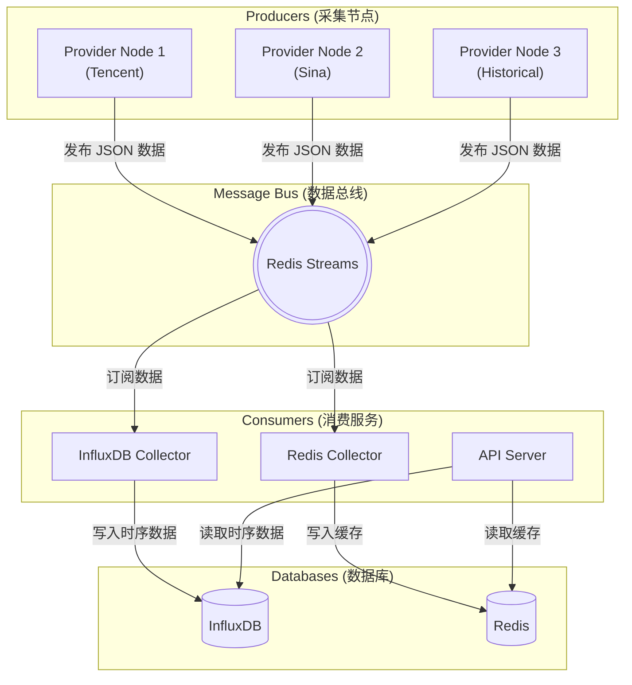

## 3. 最终架构蓝图

```mermaid
graph TD;
    subgraph "Producers (采集节点)"
        direction LR;
        P1["Provider Node 1<br>(Tencent)"];
        P2["Provider Node 2<br>(Sina)"];
        P3["Provider Node 3<br>(Historical)"];
    end

    subgraph "Message Bus (数据总线)"
        MB(((Redis Streams)));
    end

    subgraph "Consumers (消费服务)"
        direction LR;
        C1[InfluxDB Collector];
        C2[Redis Collector];
        API[API Server];
    end

    subgraph "Databases (数据库)"
        direction LR;
        DB1[(InfluxDB)];
        DB2[(Redis)];
    end

    P1 -- "发布 JSON 数据" --> MB;
    P2 -- "发布 JSON 数据" --> MB;
    P3 -- "发布 JSON 数据" --> MB;

    MB -- "订阅数据" --> C1;
    MB -- "订阅数据" --> C2;

    C1 -- "写入时序数据" --> DB1;
    C2 -- "写入缓存" --> DB2;

    API -- "读取缓存" --> DB2;
    API -- "读取时序数据" --> DB1;
```
